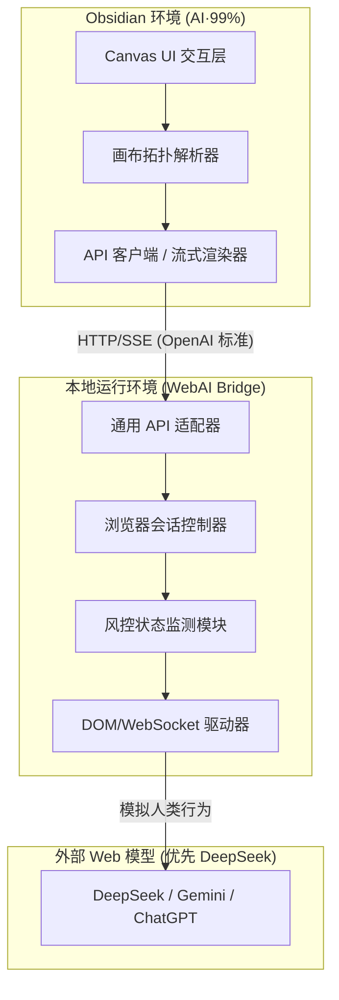

## 1. 产品愿景与定位

**AI·99%** 是一款专为 Obsidian Canvas（画布）设计的生产力增强插件。它的核心愿景是**“消弭思考与创作的断层”**，通过将非线性的画布脑图与强大的 Web 端大模型能力连接，让用户在不离开笔记环境的前提下，利用最先进的 AI 算力进行发散性思考、资料总结与内容生成。

**WebAI Bridge** 则是这一愿景的底层基石。它定位为一个**通用、轻量且具备风控感知能力**的桥接服务，旨在将原本为人类设计的 Web 界面“标准化、API 化”，为包括 AI·99% 在内的多种应用提供稳定、廉价且高效的模型调用能力。

---

## 2. 核心架构设计

项目采用**前后端完全分离**的架构。这种设计保证了插件端的轻量化，同时允许桥接服务作为一个独立的、可复用的工具运行在本地或服务器上。

### 2.1 整体架构图

### 2.2 模块核心职责

- **AI·99% (Obsidian 插件)**：
    
    - **上下文提取**：解析 Canvas 节点间的父子/关联关系，构建最符合逻辑的对话历史。
        
    - **交互注入**：在 Canvas 原生 UI 中注入触发入口，管理 AI 节点的生命周期。
        
    - **性能管理**：确保大规模流式文本输出时，Obsidian 画布不出现渲染掉帧。
        
- **WebAI Bridge (通用服务)**：
    
    - **协议转换**：接收标准的 JSON 请求，转换为 Web 端的操作序列。
        
    - **会话管理**：自动维护 Web 端的登录态，并在每次 API 调用完成后自动清理临时对话，保护用户隐私并保持 Web 界面整洁。
        
    - **风控感知**：实时监测人机验证（CAPTCHA）和频率限制，并通过 API 回传标准风控信号。
        

---

## 3. 业务流程 (Business Process)

以下是用户发起一次 AI 问答任务的完整生命周期：
### 3.1 核心交互序列

1. **触发阶段**：用户在 Canvas 中选中节点，通过右键菜单或悬浮工具栏点击“AI 问答”。
    
2. **数据准备**：AI·99% 插件逆向回溯连线，提取所有相关的祖先节点（文本、图片等），按照拓扑顺序排列，并识别当前配置的 WebAI Bridge 地址。
    
3. **请求发起**：插件在触发节点旁自动生成一个“AI 状态节点”，并向 Bridge 发起标准 API 请求。
    
4. **执行与转换**：
    
    - Bridge 启动（或复用）浏览器实例，访问 DeepSeek 等模型地址。
        
    - Bridge 检测风控：若有验证码，暂停任务并向插件发送风控警告；若正常，则在 Web 端开启“New Chat”。
        
5. **流式反馈**：
    
    - Bridge 拦截 Web 端的返回流，实时转化为标准 SSE 流推送给插件。
        
    - AI·99% 根据用户设定的频率，实时将文本渲染到 Canvas 节点中。
        
6. **任务收尾**：
    
    - 对话完成后，Bridge 自动删除该临时对话（不影响用户手动创建的对话）。
        
    - 插件固化节点内容，建立节点连线，完成闭环。
        

---

## 4. 详细需求说明：WebAI Bridge

WebAI Bridge 是整个系统的核心动力源。它的设计必须秉持**“对外部系统极度克制，对内部调用极度标准”**的原则。绝不能为了获取数据而牺牲用户的账号安全。

### 4.1 核心定位与非功能需求

- **技术选型建议**：建议使用 Node.js (搭配 Playwright/Puppeteer) 或 Python (搭配 DrissionPage/Selenium) 开发，确保对现代 Web 前端框架（如 React/Vue）构建的单页应用有极强的 DOM 穿透和网络请求拦截能力。
    
- **轻量化与静默运行**：作为后台守护进程运行，内存占用需控制在合理范围。除了遇到风控需要用户接管外，平时不得弹出浏览器窗口干扰用户日常工作。
    
- **接口标准化**：对外暴露的 HTTP 接口必须严格兼容 OpenAI 的 `/v1/chat/completions` 规范，以便除了 AI·99% 外，任何支持第三方 API 的客户端（如 NextChat、CherryStudio）都能直接调用。
    
### 4.2 会话生命周期与自动清理机制（核心痛点解决）

为了防止 API 频繁调用导致 Web 端历史对话列表产生大量“碎片垃圾”，必须实现严格的会话环境隔离与清理逻辑：

1. **对话创建标定**：每次接收到 API 请求，Bridge 必须在 Web 端触发全新的对话（New Chat），绝对禁止在原有对话中追加，以防上下文污染。系统需在内存中记录此次生成的“对话 ID”或在发送首条消息时附带隐形/特定前缀标识。
    
2. **即用即焚（Auto-Cleanup）**：
    
    - 当且仅当本次 API 流式输出完全结束（或客户端主动断开连接）后，Bridge 需异步触发 Web 端的“删除该对话”操作。
        
    - **安全红线**：服务只允许删除它自己在当前生命周期内创建的对话。严禁执行任何“清空所有历史”的操作，绝对保护用户在 Web 端手动创建的真实历史记录。
        
### 4.3 风控感知与账号安全防御机制

**“账号存活率大于一切”**。Bridge 必须具备主动退让的风控感知系统，不做暴力破解：

1. **拟人化节流**：模拟真实人类的输入延迟（Typing delay）和点击间隔，杜绝机器级别的瞬时高频并发请求。
    
2. **状态机捕获**：实时监控 Web 端的 DOM 变化和网络请求状态码。若检测到：
    
    - Cloudflare 5秒盾 / Turnstile 人机验证
        
    - Google reCAPTCHA 拦截
        
    - 账号频率超限警告（Rate Limit Exceeded）
        
    - 账号异常封禁提示
        
3. **风控熔断与异常透传**：一旦捕获上述状态，Bridge 必须**立即停止自动化脚本**，并将浏览器界面调整为可见状态（抛出窗口）。同时，API 需向调用方（如 AI·99%）返回明确的 HTTP 403/429 状态码及约定的 JSON 结构（例：`{"error": "CAPTCHA_REQUIRED", "message": "请在弹出的浏览器窗口中完成人机验证"}`），等待用户手动解封后方可恢复服务。
    
### 4.4 扩展性与多模态预留

Bridge 的架构设计需面向未来，不仅限于文本生成：

- **输入多模态**：API 接收端需支持解析 `image_url`（Base64 或本地绝对路径），并在引擎层实现自动将图片模拟拖拽/点击上传至 Web 输入框的逻辑。
    
- **输出多模态预留**：架构需预留能力，在未来支持解析 Web 端返回的图片生成结果（如抓取 DALL-E 3 生成的 `` 标签的 `src`）或视频生成占位符，转化为 Markdown 格式返回给前端。
    
### 4.5 支持的模型矩阵及优先级

Bridge 将采用模块化驱动（Driver）设计，针对不同模型编写独立的适配脚本。首期优先打通 DeepSeek。

|**优先级**|**模型/厂商名称**|**Web 端入口地址**|**研发说明与关注点**|
|---|---|---|---|
|**P0 (首选验证)**|**DeepSeek**|`https://chat.deepseek.com/`|DOM 相对简洁，响应极快，非常适合作为 MVP 阶段跑通完整链路的基石模型。|
|**P1 (核心支持)**|**Gemini**|`https://gemini.google.com/`|需处理 Google 复杂的单点登录态和底层通讯协议，支持多模态输入是重点。|
|**P1 (核心支持)**|**ChatGPT**|`https://chat.openai.com/`|风控极严（Cloudflare）。必须依赖复用本地 Cookie 和随时弹窗接管验证的机制。|
|**P2 (扩展支持)**|**Claude**|`https://claude.ai/`|账号封禁率高，需严格控制请求频率，模拟极度拟人化的请求头与行为轨迹。|
|**P3 (国内补充)**|**豆包 (Doubao)**|`https://www.doubao.com/`|作为国内无需科学上网的优质备选，前端结构变化较快，需设计容错性强的选择器。|

### 4.6 核心参考开源项目（研发必读）

为避免重复造轮子，研发团队在进行架构设计和风控对抗时，必须深度参考以下项目的设计思想：

- **参考项目**：[openclaw-zero-token](https://github.com/linuxhsj/openclaw-zero-token)
    
- **借鉴价值**：
    
    - **接管浏览器会话的工程实现**：学习其如何连接并控制已经打开的浏览器实例，复用当前用户的登录状态，避免复杂的密码登录流程。
        
    - **Web UI API 化思路**：分析其如何劫持 Web 端的 WebSocket/SSE 数据流从而实现低延迟的流式返回，而不是傻傻地去轮询 DOM 节点的文本变化。
        

---
## 5. 详细需求说明：AI·99% (Obsidian 插件端)

AI·99% 插件不仅是一个交互前端，更是一个智能的上下文调度中心。其核心职责是**交互拦截、拓扑解析、能力按需加载与流式渲染**。

### 5.1 核心交互与触发器 (Triggers)

为提供无缝的心流体验，提供以下四种触发方式：

1. **快捷命令栏触发**：选中用户文本节点，悬浮工具栏显示“AI 问答”按钮，点击后在默认布局位置生成【AI 结果节点】。
    
2. **连接线释放触发（核心体验）**：用户从某节点拉出一条连接线，在画布空白处释放。弹出的动作列表中首选项为“AI 问答”。点击后，**直接在光标释放的坐标点生成【AI 结果节点】并保持连线**。
    
3. **快捷重试 (Regenerate)**：选中已生成的【AI 结果节点】，工具栏出现“重新生成”按钮。点击后，沿用原本的触发节点重新发起请求。
    
4. **右键模型切换**：右键点击节点，菜单中展示当前启用的模型列表，点击即以该特定模型触发问答。
    

### 5.2 拓扑上下文引擎 (Context Engine)

引擎必须在 **2秒内** 完成上下文的逆向提取与组装。

- **逆向遍历与高权节点**：从“触发节点”向上追溯，直到达到【节点选取深度】或根节点。带有 `/本地提示词` 的节点无视深度限制，被强制提取并赋予最高优先级。
    
- **组装结构 (Prompt 模板)**：将提取的内容转译为带有 `<<全局设定>>`、`<<局部指令>>`、`<<思维导图拓扑关系 (Graph TD)>>`、`<<历史背景资料>>` 和 `<<本轮问题>>` 的结构化 Markdown 文本，投喂给大模型。
    

### 5.3 扩展能力中心 (多模态与搜索外置加载)

为了保证插件初始安装包的轻量化（<5MB），同时满足复杂的文档处理需求，插件采用**“基础核 + 动态能力包”**的架构。

**5.3.1 混合网络搜索策略 (Web Search Strategy)**

针对调用官方 API 时的搜索需求，采用双规策略：

- **原生支持模式**：若配置的模型（如 Gemini 官方 API、DeepSeek 联网版）原生支持网络搜索，插件只需在 API 请求 payload 中携带对应的 `search_enabled: true` 或 `tools` 参数即可，由大模型端完成搜索。
    
- **插件外置搜索模式**：针对不支持原生搜索的模型（如标准的 OpenAI API）。在插件设置中提供“独立搜索引擎”配置项（推荐接入如 Tavily Search API，其专为 LLM 优化；或配合 Scrapling 进行深度内容抓取）。触发带有网络查询属性的任务时，插件先调用独立 Search API 获取检索结果，并将其作为“临时参考节点”注入到 `<<历史背景资料>>` 中，再一并提交给大模型。
    

**5.3.2 动态按需加载模块 (OCR & PDF 解析)**

不再将庞大的解析库硬编码进插件，而是提供 **“一键热加载”** 体验：

- 在【插件设置页】新增“扩展能力”标签页。
    
- 用户点击“安装 PDF 解析引擎”或“安装本地 OCR 引擎”时，插件在后台从指定的 CDN 或 GitHub Release 下载对应的 WebAssembly (WASM) 文件和核心 JS 脚本（例如基于 WASM 构建的轻量级 `tesseract.js` 和 `pdf.js` Worker）。
    
- 文件直接保存在 Obsidian 的 `.obsidian/plugins/ai-99/workers/` 目录下。安装完成后，开关自动变绿，后续触发对应节点时即刻生效，**全程无需用户退出 Obsidian 或配置命令行环境**。
    
### 5.4 结果渲染与状态机 (Renderer & State Machine)

AI 结果节点不仅是文本框，更是任务监控器。状态机已完整兼顾“官方 API”与“桥接 API”的差异。

|**业务状态**|**节点提示文本 (占位符)**|**边框/背景视觉反馈**|**触发场景说明**|
|---|---|---|---|
|**请求排队中**|_[模型名称] 正在连接神经元..._|呼吸动画 (🔵 加载色)|通用状态|
|**流式接收中**|_(实时输出的 Markdown 内容)_|边缘滚动 (🔵 加载色)|通用状态|
|**生成完成**|_(完整的 Markdown 内容)_|静态固化 (🟢 完成色)|通用状态|
|**风控拦截**|_⚠️ 触发风控：请到浏览器界面完成验证！_|闪烁警示 (🔴 异常色)|**仅 WebAI Bridge 模式**遇到验证码时触发。|
|**API 欠费/限制**|_！！！欠费啦，要交智商税啦！！！_|静态警示 (🔴 异常色)|**仅官方 API 模式**返回 402/Insufficient Quota 时触发。|
|**Key 无效**|_！！！你的 key 没用，别填错了！！！_|静态警示 (🔴 异常色)|官方 API 鉴权失败 (401)。|
|**字数超限**|_！！！内容太多了，罢工了！！！_|静态警示 (🔴 异常色)|构建的上下文超过设定的字符阈值。|
|**异常中断**|_！！！出问题了，没传完！！！_|静态警示 (🔴 异常色)|SSE 流异常断开或网络错误。|

### 5.5 插件设置页 (Settings UI)

设置页采用 Obsidian 原生组件规范，分为四大模块：

1. **模型与通道配置**：区分“直连官方 API 通道”与“WebAI Bridge 通道”。管理供应商、模型名称、Base URL 与 API Key。
    
2. **上下文控制阀**：通过滑动条控制【节点选取深度】与【最大字符数限制】。
    
3. **扩展能力中心**：提供网络搜索 API (如 Tavily) 的 Key 配置入口；提供 PDF 解析模块、OCR 识别模块的“一键下载与启用”按钮。
    
4. **提示词与 UI 定制**：配置全局 Prompt，自定义各个状态的响应颜色（加载色、完成色、异常色）。
    

### 5.6 研发参考项目

研发团队在开发 AI·99% 插件端时，需深度拆解以下开源项目：

- **[Obsidian Augmented Canvas](https://github.com/MetaCorp/obsidian-augmented-canvas)**：
    
    - **借鉴价值**：该项目是目前将大模型与 Obsidian 画布结合的标杆。核心参考其未完全公开的 Canvas API 调用方式（如何获取节点坐标、如何绘制连线）、右键菜单注入逻辑，以及在画布中实现流式打字机效果且不引起严重卡顿的性能优化方案。
        
### 5.7 详细需求补充

[[AI·99%- obsidian插件Beta1.0.0需求文档]] 
	此文档详细描述了插件部分的需求，遇到于本需求不一致、冲突的情况，请以本需求文档为主，若本需求中未提及，则以1.0.0需求文档为主

---

## 6. 技术难点与风险控制

在融合 Obsidian 原生能力与 Web 端自动化技术的过程中，研发团队需要重点关注并攻克以下技术屏障：

### 6.1 WebAI Bridge 的反爬与风控对抗

- **难点描述**：Web 端大模型（尤其是基于 Cloudflare 防护的 ChatGPT 或 Google 风控体系下的 Gemini）对无头浏览器（Headless Browser）有极强的特征识别能力。
    
- **架构师应对策略**：
    
    - **放弃纯无头模式**：强制使用有头模式（Headful）启动浏览器，但在操作系统层面将窗口最小化或隐藏到虚拟桌面。
        
    - **指纹混淆与接管**：注入隐蔽的 WebDriver 抹除脚本（如 `stealth.min.js`），并实时监听 HTTP 403 状态码和特定的拦截 DOM 元素。一旦触发风控，立即弹窗要求用户接管，拒绝机器暴力尝试。
        

### 6.2 Canvas 流式渲染的高频重绘 (Reflow/Repaint)

- **难点描述**：大模型流式输出时（SSE 协议），每秒可能返回数十个 Token。如果每次接收都触发 Obsidian 核心 DOM 的全量重排，白板在生成期间将完全卡死，无法缩放或拖拽。
    
- **架构师应对策略**：
    
    - **读写分离与防抖节流**：在前端维护一个内存文本池。接收流式数据时只写入内存池，通过 `requestAnimationFrame` 或设定的 100ms 定时器将缓冲池的内容批量同步至 DOM 节点。
        
    - **尺寸锁定**：在流式生成期间，临时锁定【AI 结果节点】的 CSS 宽高动态计算（避免白板整体拓扑不断变化），待生成结束后再一次性触发自适应布局调整。
        

### 6.3 超长上下文陷阱与文本压缩损耗

- **难点描述**：即便设置了最大字符数限制，大量提取祖先节点（特别是包含了完整 PDF 解析内容时）依然极易导致 Token 爆表或核心信息被大模型遗忘（Lost in the middle）。
    
- **架构师应对策略**：
    
    - **前置长文本摘要技能**：在 AI·99% 的核心处理链路中，引入长文本压缩与摘要策略。当检测到单一节点输入内容过长时，先通过轻量级本地算法（如基于 TextRank 的关键句提取）或调用成本极低的附属模型进行初步浓缩，再拼接进最终的 Prompt 中，以此保障核心问答逻辑的精准度。
        

### 6.4 动态扩展包 (WASM) 的网络与存储依赖

- **难点描述**：依赖 CDN 动态拉取 PDF 解析与 OCR 的 WASM 模块，可能因网络环境受限而失败。
    
- **架构师应对策略**：
    
    - 支持离线按需加载机制。设定明确的回退策略：若在线拉取失败，允许用户手动将依赖包下载并拖入指定的插件配置文件夹中进行识别。
        

---

## 7. 实施路径与里程碑规划 (Roadmap)

为了控制研发风险，避免“大爆炸”式的发布导致项目失控，建议采用敏捷迭代策略，分为三个主要阶段进行交付：

### 阶段一 (Phase 1)：基础设施与纯 API 跑通 (MVP 版本)

- **核心目标**：验证 AI·99% 在 Obsidian 中的交互体验。
    
- **开发重点**：
    
    1. 实现 Canvas 节点选取的逆向拓扑算法（Graph TD 结构化拼接）。
        
    2. 完成三种触发交互：快捷命令栏、连接线释放触发（高优）、右键重试。
        
    3. 接通 DeepSeek 或 OpenAI 的**官方标准 API**，实现流式渲染和节点状态机（呼吸加载色 -> 完成色 / 异常色）。
        
- **交付标准**：在纯文本环境下，用户可以丝滑地使用官方 API 进行网状心流问答。
    

### 阶段二 (Phase 2)：WebAI Bridge 引擎打造与便携部署

- **核心目标**：打通“免费算力”，完成 Web 到 API 的转换底层建设。
    
- **开发重点**：
    
    1. 构建 WebAI Bridge 核心服务，优先完成 DeepSeek Web 和 Gemini Web 的会话接管、输入提交与 SSE 流式返回提取。
        
    2. 实现“即用即焚”的会话自动清理机制与风控拦截信号透传。
        
    3. **便携化部署适配**：考虑到工作环境切换的需求，Bridge 引擎及相关的浏览器环境依赖需支持指向自定义安装路径。建议在配置层面支持将其完整部署至 `MacExternal` 等移动硬盘中，实现跨设备即插即用的无缝衔接。
        
- **交付标准**：AI·99% 切换至 Bridge 通道，能够稳定调用 Web 端能力而不引发封号，遇到验证码能正常弹出提示窗口。
    

### 阶段三 (Phase 3)：多模态外挂与信息广度拓展

- **核心目标**：赋予 AI·99% 读图、读文档与联网看世界的能力。
    
- **开发重点**：
    
    1. **搜索能力融合**：在插件端集成 Scrapling 与 Tavily Search API，实现触发查询时的高效网页数据抓取，并作为历史资料注入上下文。
        
    2. **WASM 动态加载**：实现设置页的扩展能力中心，一键热加载 `tesseract.js` 和 `pdf.js`。
        
    3. 完善图片与 PDF 节点的内容提取规则。
        
- **交付标准**：用户可以在画布中拖入一张图或一份 PDF，连线向外提问并获取精准回答。
    

---

## 📘 附录：Obsidian 插件开发核心词汇对照表

这份附录是团队的“技术导航图”。在 Obsidian 插件开发中，许多 Canvas（画布）相关的 API 并未完全公开在官方文档中（属于 Internal API），因此准确的词汇对齐能让开发者在 GitHub 搜索或在 Discord 开发者频道提问时事半功倍

| **需求文档概念 (AI·99%)** | **Obsidian 官方/技术术语**                  | **核心调用方法/类 (API / Module)**                                  | **来源与验证地址**                                                                                                                                               |
| ------------------- | ------------------------------------- | ------------------------------------------------------------ | --------------------------------------------------------------------------------------------------------------------------------------------------------- |
| **画布 (Canvas)**     | **Canvas View**                       | `CanvasView`, `CanvasData`                                   | [Obsidian API](https://www.google.com/search?q=https://github.com/obsidiansoftware/obsidian-api&authuser=1)                                               |
| **触发节点/AI 节点**      | **Canvas Node**                       | `AllCanvasNodeData`, `TextNodeData`                          | [Canvas API Typings](https://www.google.com/search?q=https://github.com/obsidiansoftware/obsidian-api/blob/master/canvas.d.ts&authuser=1)                 |
| **连线 (Edge)**       | **Canvas Edge**                       | `CanvasEdgeData`, `edge.from`, `edge.to`                     | [Obsidian Developer Docs](https://www.google.com/search?q=https://docs.obsidian.md/Plugins/Editor/Canvas&authuser=1)                                      |
| **逆向遍历 (回溯)**       | **Graph Traversal**                   | `canvas.nodes`, `canvas.edges.filter()`                      | [Augmented Canvas Source](https://github.com/MetaCorp/obsidian-augmented-canvas)                                                                          |
| **右键菜单注入**          | **Context Menu**                      | `onContextMenu`, `Menu.addItem()`                            | [Obsidian Plugin FAQ](https://www.google.com/search?q=https://docs.obsidian.md/Plugins/User%2Binterface/Context%2Bmenu&authuser=1)                        |
| **连线释放触发**          | **Edge Connection Event**             | `canvas.on("edge-menu", ...)` (Internal)                     | [Obsidian Forum - Canvas API](https://forum.obsidian.md/)                                                                                                 |
| **设置页**             | **Setting Tab**                       | `PluginSettingTab`, `Setting`                                | [Setting Tab Guide](https://docs.obsidian.md/Plugins/User+interface/Settings)                                                                             |
| **流式渲染**            | **Streaming / Markdown Render**       | `MarkdownRenderer.render()`, `requestAnimationFrame`         | [Markdown Rendering](https://docs.obsidian.md/Plugins/Editor/Markdown+post+processing)                                                                    |
| **本地提示词权重**         | **Frontmatter / Metadata**            | `app.metadataCache`, `cachedRead()`                          | [MetadataCache API](https://docs.obsidian.md/Reference/TypeScript+API/MetadataCache)                                                                      |
| **WASM 动态加载**       | **Web Worker / WASM**                 | `Worker`, `WebAssembly.instantiate()`                        | [MDN WebAssembly](https://developer.mozilla.org/en-US/docs/WebAssembly)                                                                                   |
| **网络请求 (Bridge)**   | **Request / Fetch**                   | `requestUrl` (绕过跨域限制的核心方法)                                   | [Obsidian requestUrl](https://docs.obsidian.md/Reference/TypeScript+API/requestUrl)                                                                       |
| **拓扑图转文本**          | **Serialization**                     | `JSON.stringify(canvasData)`, `Mermaid`                      | [Mermaid.js Docs](https://mermaid.js.org/)                                                                                                                |
| **悬浮工具栏**           | **Canvas Selection Menu / Toolbar**   | `canvas.menu` / `Menu.addItem()`                             | [Canvas Source Analysis (Community)](https://www.google.com/search?q=https://github.com/obsidiansoftware/obsidian-api/blob/master/canvas.d.ts&authuser=1) |
| **工具栏注入**           | **Selection Menu Injection**          | `CanvasView.onContextMenu` / `canvas.requestSave()`          | [Augmented Canvas Source](https://github.com/MetaCorp/obsidian-augmented-canvas)                                                                          |
| **节点颜色**            | **Node Color / CanvasNodeData.color** | `node.setColor("color_id")` / `node.setData({color: "..."})` | [Obsidian Developer Docs (Canvas)](https://www.google.com/search?q=https://docs.obsidian.md/Plugins/Editor/Canvas&authuser=1)                             |
| **状态颜色切换**          | **Color Constant / Hex Code**         | `canvas.getColor()` / `node.render()`                        | [Obsidian Forum - Color API](https://forum.obsidian.md/)                                                                                                  |

---

## 🔍 深度分析与搜索建议

### 1. 关于“影子 API” (Internal Canvas API)

由于 Obsidian 官方文档对 Canvas 的描述较为简略，研发团队在实现“连线释放触发”或“自动排版”时，应重点搜索 **`obsidian-canvas.d.ts`**。这是社区开发者通过逆向工程整理出的完整类型定义文件。

- **验证建议**：在 GitHub 搜索 `path:*.ts "CanvasView"` 可以看到其他插件是如何“魔改”画布的。
    

### 2. 跨域与 WebAI Bridge 通信

Obsidian 运行在 Electron 环境下，标准的 `fetch` 可能会遇到 CORS（跨域）限制。

- **关键术语**：**`requestUrl`**。
    
- **理由**：这是 Obsidian 提供的特权 API，可以绕过浏览器的同源策略。在 AI·99% 插件与 WebAI Bridge 通信时，**必须使用 `requestUrl` 而非原生的 `fetch`**。
    
### 3. 多模态 (OCR/PDF) 的本地性能

在搜索 OCR 实现时，词汇应聚焦于 **“WASM-based Tesseract”**。

- **关键术语**：**`Worker Thread`**。
    
- **理由**：为了防止 PDF 解析时 Obsidian 界面“假死”，必须在 `Worker`（工作线程）中运行解析任务，这是开发者论坛中公认的性能优化准则。
    

### 4. 悬浮工具栏与节点颜色：深度技术解析
#### 1.1 悬浮工具栏 (Selection Menu) 的注入逻辑

在 Obsidian Canvas 中，当选中一个或多个节点时出现的横向工具栏，其底层被称为 `CanvasMenu`。
- **实现方式**：官方 API 并没有直接提供 `registerCanvasToolbarItem` 这样的方法。主流做法是通过 **Monkey Patching（猴子补丁）** 拦截 `CanvasView` 的 `onContextMenu` 事件，或者监听画布的选中状态变化。
    
- **搜索关键词建议**：`"obsidian-canvas" selection menu`、`"CanvasView" menu.addItem`。
    
- **参考逻辑**：研发团队可以参考 `obsidian-augmented-canvas` 中如何定位当前选中的 `node` 实例，并调用 `menu.addItem` 在原生“连线”、“删除”等按钮旁插入自定义的“AI 问答”按钮。
    
#### 1.2 控制节点颜色 (Node Color)

Canvas 节点的颜色在底层数据（`.canvas` 文件）中是一个 `color` 字段，它通常对应一个数字索引（1-6 代表预设颜色）或一个十六进制色值。

- **实现方式**：
    
    - **预设切换**：调用节点实例的内部方法 `node.setColor("1")`（1-6）。
        
    - **自定义色值**：通过 `node.setData({ color: "#hex_code" })` 并调用 `canvas.requestSave()`。
        
- **状态反馈逻辑**：对于您需求中的“加载色（呼吸灯）”，建议不要通过修改 `.canvas` 文件的持久化数据来实现，而是直接通过 CSS 类名注入。例如：为正在生成的节点添加一个 `.is-ai-loading` 的 CSS 类，在插件的 `styles.css` 中定义该类的动画效果。
    

---

## 🛠️ 研发参考资源库 (验证地址)

1. **官方插件开发文档 (Beta版)**: [https://docs.obsidian.md/](https://docs.obsidian.md/)
    
    - _验证项_：设置页逻辑、基本文件操作、Markdown 渲染。
        
2. **Obsidian API 类型定义 (GitHub)**: [https://github.com/obsidiansoftware/obsidian-api](https://www.google.com/search?q=https://github.com/obsidiansoftware/obsidian-api&authuser=1)
    
    - _验证项_：最权威的接口定义，虽然 Canvas 部分更新较慢，但它是所有调用的基石。
        
3. **Obsidian Hub (社区维基)**: [https://publish.obsidian.md/hub/](https://publish.obsidian.md/hub/)
    
    - _验证项_：搜索 "Canvas API" 可以找到社区整理的非官方指南，对实现 AI·99% 的高级交互至关重要。
        
4. **开发者 Discord 频道 (#plugin-dev)**: 需通过 Obsidian 官网加入。
    
    - _验证项_：实时搜索 "Canvas internal methods" 或 "requestUrl SSE"，能找到关于流式传输的最前沿讨论。
        

---
